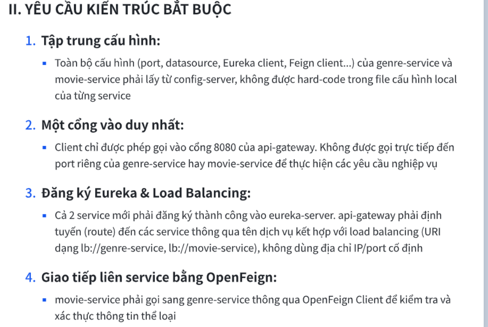
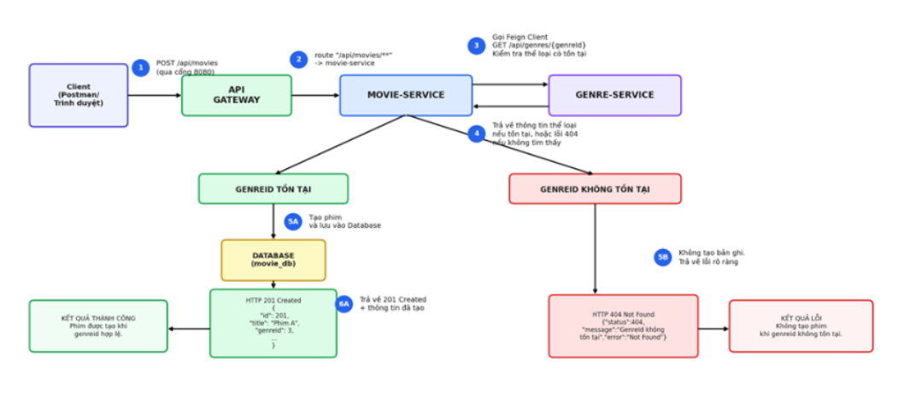
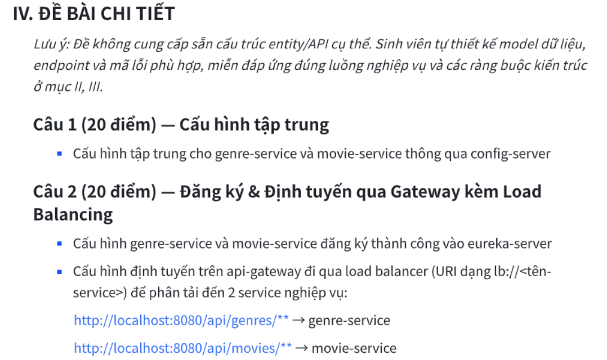
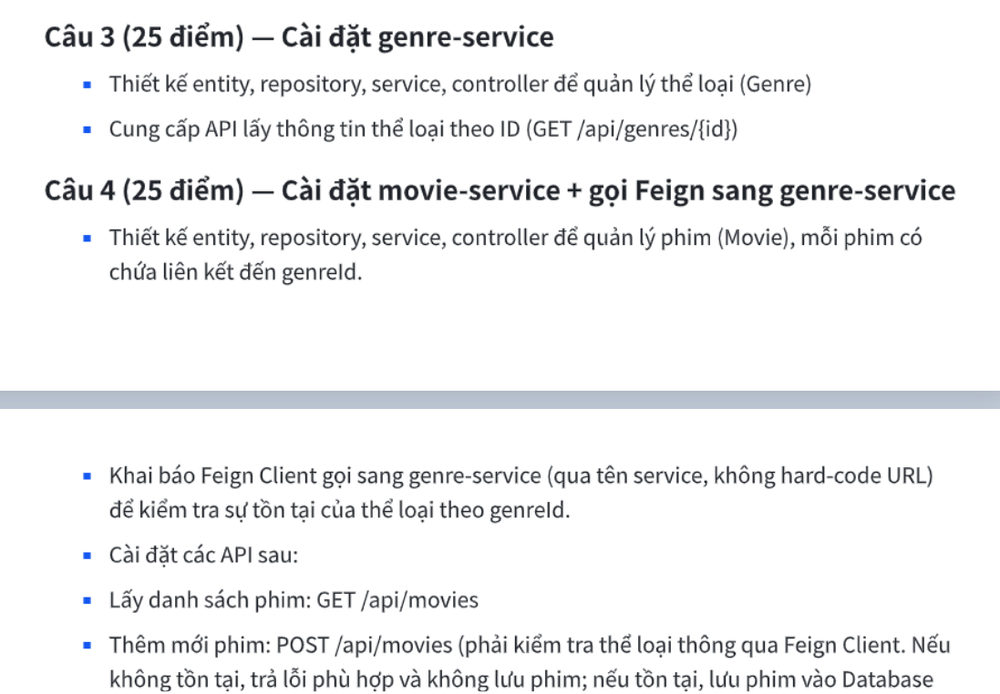
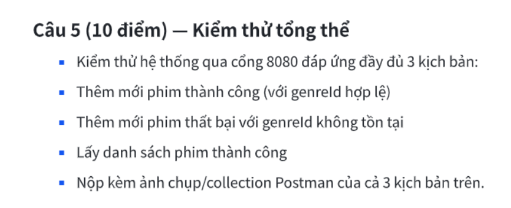

đọc 5 hình ảnh có trong file de.md và trong project để hiểu được đề bài,
từ đó làm giúp tôi 1 mincroservice theo đề yêu cầu để test dược các api không lỗi kết nối db hay lỗi version gradle....
Hãy làm nhanh nhất có thể, và đảm bảo code chạy được trên môi trường của máy.Tôi không cần bạn chay test hoàn toàn,
chỉ cần có và chạy được các api, file .env lưu name,pass kết   nối sql vậy nên  các file yml phải lấy từ .env.